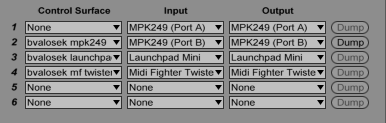

# MIDI Remote Scripts for Ableton Live 9

Performance-oriented custom controller scripts for the Akai MPK249, MIDI
Fighter Twister, and Novation Launchpad.

## Overview

These mappings were built specifically for how I use my gear, not for having
huge amounts of flexibility. I use the Twister only for interacting with
devices, the controls on the MPK249 only for managing track state, and my
Launchpad for recording and clip launching.

This keeps each controller associated with a specific role when jamming.

## Installation

Copy the entire repo contents into the MIDI Remote Scripts directory for
Ableton Live (see the [official
documentation](https://www.ableton.com/en/help/article/install-third-party-remote-script/)).
Alternatively, you could clone this repo right into the MIDI Remote Scripts
directory.

If you aren't familiar with git and just want a download, go to the [latest
releases](https://github.com/bvalosek/ableton-live-scripts/releases) and
download a ZIP file and copy all contents into the MIDI Remote Scripts
directory.

## Setup

Once the scripts are installed via the above instructions, open Live and go to
Preferences -> MIDI and set the Control Surface, Input, and Output sections as
follows:

Setting Control Surface to None for MPK249 (Port A) prevents the default MPK
mapping from loading.

## Controllers

### MPK249

* Controls used primarily for mixing and managing track state during performances
* Only BANK A of the controls are mapped, B and C are unmapped
* Transport controls (other than loop and record) are mapped as expected
* Track offset position follows Launchpad (if present)
* Record button functions as SHIFT button to alter role of encoders, faders,
  buttons, and transport section
* Keys on MIDI Channel 1, Pads on MIDI Channel 2 (with colors corresponding to
  GM drum instrument types). Other pad banks are not used
* Make sure to use the corresponding preset `25: bvalosek`, loaded via the DUMP
  button in Ableton Live (See Setup instructions above)

#### Mapping

### MIDI Fighter Twister

* Used for managing devices, their parameters, state, and nested chains.
* Only BANK 1 is used, the other 3 banks are unmapped.
* Colors used to identify parameter and device chains by name. The first word
  determines the color, so things named similarly will be visibly related.
* Factory Default firmware mappings are fine (though I tend to adjust the
  sensitivity)

#### Mapping

## License

MIT

